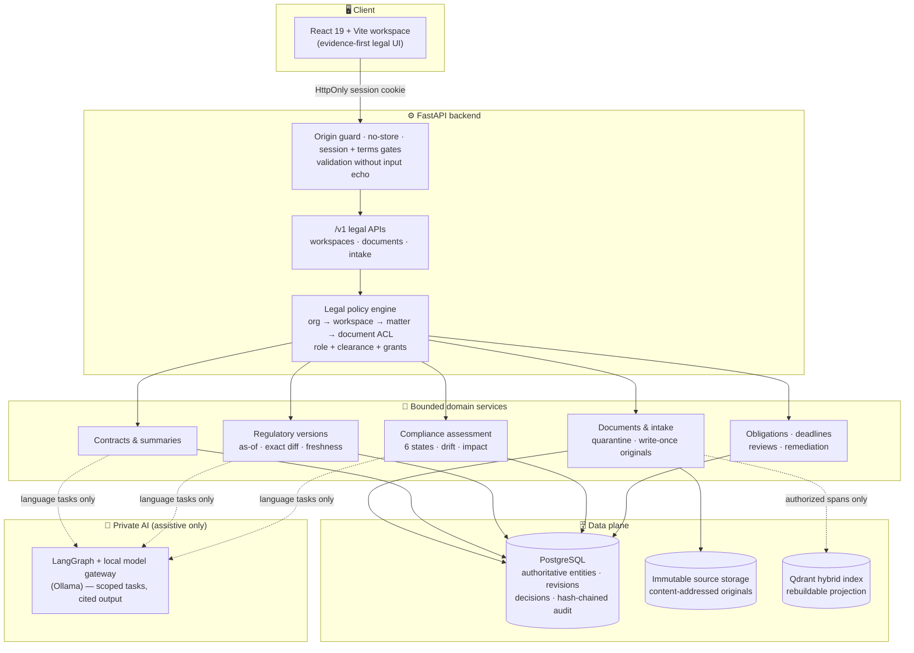
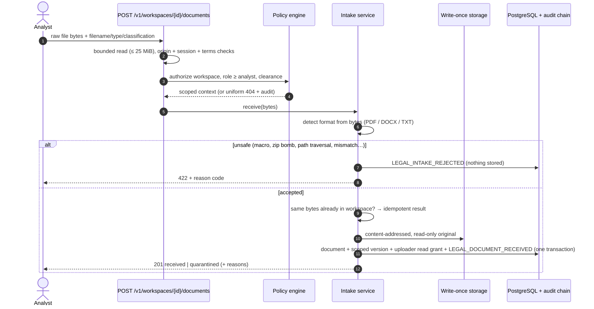
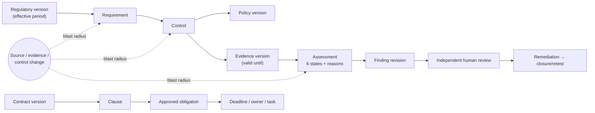

<div align="center">

# ⚖️ Legal & Regulatory Assurance Platform

**Contract intelligence · Regulatory change monitoring · Compliance assurance · Grounded legal summaries**

One governed, evidence-first workspace where every AI suggestion is traceable to an exact source span,
every decision is made by an authorized human, and every change is written to a tamper-evident audit chain.

[](https://github.com/loktrishal-05/legal-compliance-regulatory-workbench/actions/workflows/legal-backend-checks.yml)


[Architecture](#%EF%B8%8F-architecture) · [How it works](#-how-it-works) · [Status](#-build-status) · [Getting started](#-getting-started) · [Contributors](#-contributors)

</div>

---

## ✨ What it is

Legal and compliance teams juggle contracts, regulations that keep changing, internal policies, controls and
evidence that expires. This platform connects all of them into **one persistent, auditable lifecycle**:

| Pillar | What it does |
|---|---|
| 📄 **Contract intelligence** | Ingests PDF/DOCX/TXT contracts, extracts parties, clauses, obligations, dates and deviations from approved playbooks — each finding linked to the exact page/section/offset it came from. |
| 🏛️ **Regulatory intelligence** | Tracks approved regulatory sources and versions with effective periods, computes exact structural diffs between versions, and routes applicability/materiality decisions to qualified humans. |
| ✅ **Compliance assurance** | Maps requirement → control → policy → evidence, evaluates them with versioned deterministic rules into **six explainable states**, detects stale evidence and drift, and traces the blast radius of every change. |
| 📝 **Grounded summaries** | Executive, clause, risk and obligation summaries where every material statement cites stored source spans — no citation, no claim. |

It is **not** a PDF chatbot, does not sign or file anything, and never lets an AI model approve, accept risk or decide a final compliance status.

---

## 🏗️ Architecture

Reuse-first: the platform grows out of a mature, security-hardened industrial workbench (sessions, approvals,
tamper-evident audit, hybrid retrieval, durable execution) and adds bounded legal domain services on top.



**Design principles**

- **Deterministic core, assistive AI.** Identity, permissions, state transitions, timers, rules and audit hashing are plain, testable code. Models extract, compare and draft — they never decide.
- **Deny by default.** Membership alone reveals nothing; access needs an active membership, role, clearance, explicit document grant and (if set) matter access. Unknown and denied IDs return the *same* 404 and are audited.
- **Tenant-safe by construction.** Every legal object carries organization + workspace ownership, enforced with composite foreign keys in the database, not just in application code.
- **Immutable evidence.** Originals are hashed and written once; corrections create new revisions; history is never rewritten.
- **Projections are not truth.** Search indexes are rebuildable views; PostgreSQL is the system of record.

---

## 🔄 How it works

### Document intake (built)



Anything suspicious — active PDF content, embedded archives, external references, scanner findings, or **no configured malware scanner** — is `quarantined` and never parsed.

### The compliance "digital twin" (relational, no graph DB)



**Six assessment states** — `satisfied` · `partially_satisfied` · `unsatisfied` · `insufficient_evidence` · `not_applicable` · `needs_review`.
Missing evidence means *insufficient*, never *violation*. `not_applicable` requires an authorized human decision.
Expired or superseded evidence and changed sources invalidate the **current** conclusion and add reasons — historical assessments are never rewritten.

### Access model

| Scoped role | Can read sources | Can propose | Review authority |
|---|---|---|---|
| Analyst | granted documents | ✅ | — |
| Legal reviewer | granted contract matters | ✅ | legal decisions |
| Compliance reviewer | granted requirements/evidence | ✅ | compliance decisions |
| Business owner · Auditor · Viewer | granted only | — | — |
| Workspace admin | metadata only | — | — (provisions *others*, never itself) |

Reviews additionally require the platform reviewer role and a requester who is not the reviewer.

---

## 📊 Build status

Honest, phase-gated progress against the 66 functional requirements of the [master specification](docs/Legal_Regulatory_Assurance_Platform_Master_Report.pdf). Nothing is "done" because code exists — only when its exit checks pass.

| Phase | Scope | Status |
|---|---|---|
| A · B | Repository custody, architecture, domain contracts, 66-FR registry | ✅ Complete |
| C | Product identity (backend verified; frontend owner-managed) | 🟡 Backend done |
| D | Tenancy, ACL policy, audited provisioning, per-workspace dedupe, legacy isolation | ✅ Development exit checks pass |
| E | Secure intake ✅ · extraction to exact source spans · scoped retrieval | 🟡 In progress |
| F | Contract analysis, playbooks, cited summaries | ⏳ Planned |
| G · H | Regulatory versions / compliance assessment — deterministic core ✅, persistence + APIs | 🟡 In progress |
| I · J | Obligations, deadlines, reviews, remediation, legal audit | 🟡 In progress (workstream 3) |
| K | Frontend journeys | 🧑‍💻 Owner-managed |
| L · M | Security hardening, evaluation, recovery, full acceptance | ⏳ Planned |

Live details: [migration plan](docs/LEGAL_DOMAIN_MIGRATION_PLAN.md) · [validation evidence](docs/VALIDATION_REPORT.md) · [requirement traceability](docs/LEGAL_REQUIREMENT_TRACEABILITY.md).

---

## 🧰 Tech stack

| Layer | Technology |
|---|---|
| Frontend | React 19, Vite 7 |
| API | FastAPI, Pydantic v2 (strict schemas, `extra="forbid"`) |
| Persistence | PostgreSQL 17, SQLAlchemy 2, Alembic (additive migrations, lossy downgrades refused) |
| Retrieval | Qdrant dense + sparse hybrid search, local reranking |
| Documents | PyMuPDF / OCR provenance, standard-library DOCX archive inspection |
| AI | LangGraph orchestration, local model gateway (Ollama) — no hosted inference |
| Security | Opaque HttpOnly sessions, CSRF/origin guard, Argon2, SHA-256 hash-chained audit log |
| CI | GitHub Actions `legal-core`: disposable PostgreSQL, scoped tests, migration acceptance |

---

## 📁 Repository layout

```text
backend/
  app/
    api/routes/        legal_scope.py (/v1 legal APIs) + platform routes
    services/          legal_policy · legal_provisioning · legal_intake
                       regulatory_versions · compliance_assessment · audit · approval …
    db/models/         legal_scope.py + shared Document/DocumentVersion/AuditEvent …
  alembic/versions/    0019–0023 legal migrations (head: 0023_legal_intake_audit)
  scripts/             validate_legal_migrations.py · legal_provisioning_cli.py
  tests/               test_legal_scope_*.py · test_legal_regulatory_core.py
frontend/              React/Vite application
infra/                 isolated Compose projects (incl. disposable legal-core test)
docs/                  master spec, build contracts, plan, progress, validation
```

---

## 🚀 Getting started

> Read [`AGENTS.md`](AGENTS.md) and the [runtime guide](docs/LEGAL_RUNTIME_SETUP.md) first. Never point the app at another application's database, index or model endpoint, and never overwrite an existing `.env`.

**Run the legal test suite** (disposable PostgreSQL, synthetic data, no network, no host ports):

```bash
docker compose -f infra/docker-compose.legal-core-test.yml config --quiet
docker compose -f infra/docker-compose.legal-core-test.yml run --rm tests
docker compose -f infra/docker-compose.legal-core-test.yml run --rm tests python -B -m scripts.validate_legal_migrations
docker compose -f infra/docker-compose.legal-core-test.yml down --volumes
```

**Bootstrap a workspace** (operator-only, audited, no HTTP endpoint), from `backend/`:

```bash
python -m scripts.legal_provisioning_cli bootstrap --operator "<your name>" \
  --organization "<org>" --workspace "<workspace>" --admin-user <user-uuid>
```

**Health check** after an approved local start: `GET http://127.0.0.1:18000/health`

```json
{"status":"ok","service":"legal-compliance-regulatory-workbench-backend"}
```

Isolated local ports: backend `18000`, frontend `15173`, PostgreSQL `55432`, Qdrant `16333/16334`.

---

## 🤝 Contributing

1. Branch from `feat/legal-regulatory-platform-migration` (the protected development branch — not `main`).
2. Keep changes small and coherent; stage explicit paths; no force-pushes.
3. Add `backend/tests/test_legal_scope_<topic>.py` with a PostgreSQL variant; synthetic fixtures only.
4. Update the plan, progress, validation and traceability docs in the same PR.
5. Open a PR; `legal-core` must pass and the integrator reviews every commit before merge. Accepted work is promoted to `main`.

---

## 👥 Contributors

| Contributor | GitHub | Role |
|---|---|---|
| Loktrishal K | [@loktrishal-05](https://github.com/loktrishal-05) | Product owner · architecture · frontend & landing page · repository maintainer |
| Harsha | [@Harsha-code-per](https://github.com/Harsha-code-per) | Workstream 1 — documents, contracts & grounded summaries ([#1](https://github.com/loktrishal-05/legal-compliance-regulatory-workbench/issues/1)) |
| Sanjjith | [@Sanjjith27](https://github.com/Sanjjith27) | Workstream 2 — regulatory intelligence & compliance assurance ([#3](https://github.com/loktrishal-05/legal-compliance-regulatory-workbench/issues/3)) |
| Cholan | [@Cholan-kinnera](https://github.com/Cholan-kinnera) | Workstream 3 — workflows, review, security & acceptance ([#2](https://github.com/loktrishal-05/legal-compliance-regulatory-workbench/issues/2)) |

Backend implementation and integration review are AI-assisted (Claude as integrator, Codex for workstream 3) under the owner's direction; every change goes through a PR and the `legal-core` checks.

---

## 🛡️ Boundaries

- AI output is **advisory**. No legal advice, contract signing, regulatory filing, compliance certification or autonomous high-impact action.
- No live regulatory connector is claimed — regulatory content arrives through manual, approved imports.
- Development uses public/synthetic fixtures only. Enterprise SSO/MFA, validated jurisdiction packs, retention/legal-hold policy, malware scanning and recovery targets are **release gates** that still need qualified owners.
- The [master report](docs/Legal_Regulatory_Assurance_Platform_Master_Report.pdf) is the product authority and is kept byte-for-byte unchanged.

<details>
<summary>📚 Historical platform records</summary>

Earlier industrial implementation documents are preserved as provenance — not current setup instructions or legal acceptance:
[Phase 3A ingestion](docs/phase3a.md) · [3B1 P&ID OCR](docs/phase3b1.md) · [3B2 hybrid retrieval](docs/phase3b2.md) ·
[3C sensor data](docs/phase3c.md) · [4A model gateway](docs/phase4a.md) · [4R agent safety](docs/phase4-repair.md) ·
[5A governance](docs/phase5a.md) ([validation](docs/phase5a-validation.md)) · [5B approvals](docs/phase5b.md) ([validation](docs/phase5b-validation.md)).

</details>
