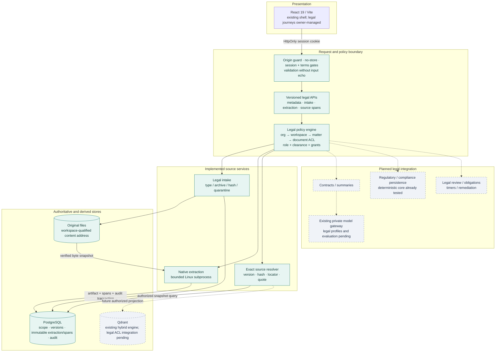
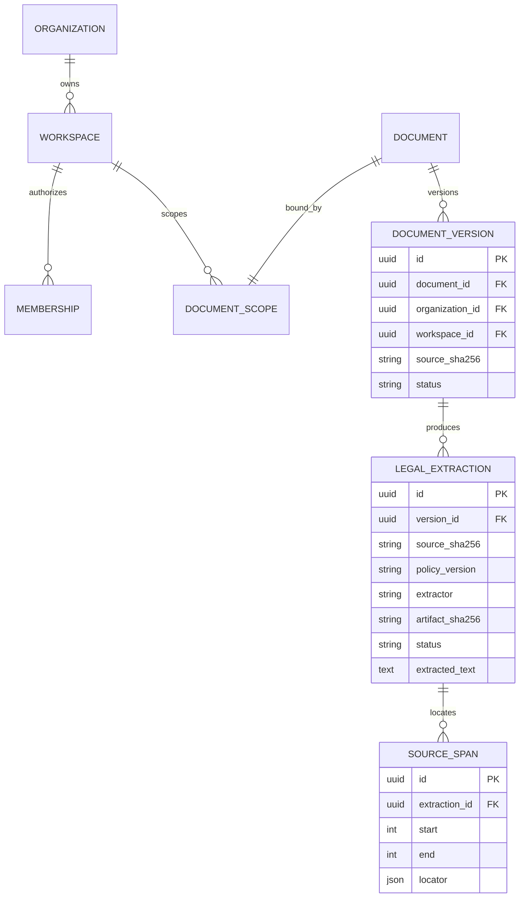
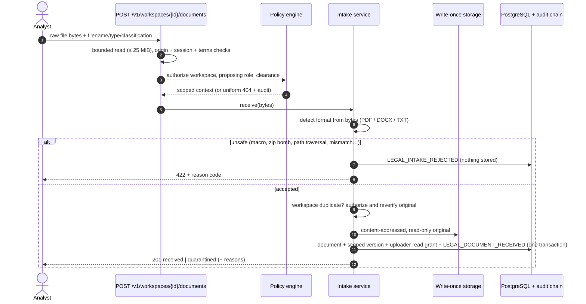
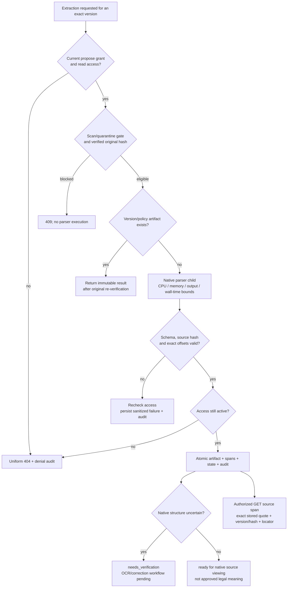
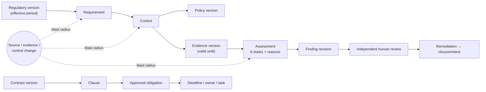

<div align="center">

# Legal & Regulatory Assurance Platform

### From legal text to traceable decisions.

An evidence-first platform connecting **contract intelligence, regulatory change, compliance assurance,
and grounded summaries** through persistent source provenance and human-governed workflows.

[](https://github.com/loktrishal-05/legal-compliance-regulatory-workbench/actions/workflows/legal-backend-checks.yml)


[Architecture](#architecture) · [System design](#system-design) · [Workflows](#workflows) · [API](#api-surface) · [Verification](#verification) · [Quick start](#quick-start)

</div>

---

> [!IMPORTANT]
> **Development checkpoint, not pilot acceptance.** This continuation branch includes tested tenancy,
> secure intake, native extraction, and immutable source spans. OCR/corrections, legal retrieval,
> contract analysis, persistent compliance workflows, and operational acceptance remain in progress.
> [PR #13](https://github.com/loktrishal-05/legal-compliance-regulatory-workbench/pull/13) tracks this checkpoint;
> the default `main` branch does not yet contain it. Real HTTP uploads remain quarantined while no malware scanner is configured.

## Product scope

Legal and compliance teams juggle contracts, regulations that keep changing, internal policies, controls and
evidence that expires. This platform connects all of them into **one persistent, auditable lifecycle**:

| Product pillar | Intended operational outcome | Current implementation |
|---|---|---|
| **Contract intelligence** | Source-linked clauses, parties, duties, dates, deviations and reviewed obligations | Native document/source foundation; analysis/playbooks planned |
| **Regulatory intelligence** | Governed sources, effective versions, changes and human applicability decisions | Deterministic as-of selection, exact diff and freshness logic; persistence planned |
| **Compliance assurance** | Requirement → control → evidence mappings, six explainable states and change impact | Deterministic assessment, expiry/drift reasons and workspace-bounded impact logic; domain workflow planned |
| **Grounded summaries** | Audience-specific summaries whose material claims resolve to exact source evidence | Version/hash-bound quote resolver; summary generation and acceptance planned |

**Core design rule:** models may extract, compare and draft. Deterministic services own permissions,
state transitions, evidence checks and timers; authorized humans own material legal decisions.

---

## Architecture

The system is a **modular monolith** built on FastAPI and PostgreSQL. Existing sessions, audit,
native extraction and governance primitives are reused; legal ownership and provenance are additive.
Search and language models are downstream capabilities, not systems of record.

**Solid paths are implemented in this checkpoint. Dashed paths represent planned legal integration.**



**Design principles**

- **Deterministic core, assistive AI.** Identity, permissions, state transitions, timers, rules and audit hashing are plain, testable code. Models extract, compare and draft — they never decide.
- **Deny by default.** Membership alone reveals nothing; access needs an active membership, role, clearance, explicit document grant and (if set) matter access. Unknown and denied IDs return the *same* 404 and are audited.
- **Tenant-safe by construction.** Every legal object carries organization + workspace ownership, enforced with composite foreign keys in the database, not just in application code.
- **Immutable evidence.** Originals are hashed and published without overwrite; extraction/spans reject UPDATE, DELETE and TRUNCATE. Corrections must use successor revisions; that workflow is still pending.
- **Projections are not truth.** Search indexes are rebuildable views; PostgreSQL is the system of record.

---

## System design

### Authority, storage and failure boundaries

| Concern | System of record / execution boundary | Failure behavior |
|---|---|---|
| Identity and permissions | Existing cookie sessions + current database membership, role, clearance and document/matter grants | Deny access; unknown and inaccessible legal resources share a 404 |
| Original content | Workspace-qualified file address + immutable source hash | Hash/path mismatch blocks extraction; missing files are not silently repaired |
| Extraction | Resource-bounded Linux child process over one verified byte snapshot | Timeout/invalid output fails closed; sanitized failure code and state share an audit transaction |
| Derived provenance | Immutable PostgreSQL extraction and span rows; tenant/version/hash-qualified foreign keys | Cross-tenant links and historical rewrites are rejected |
| Legal meaning | Planned versioned analyses, sufficient citations and independent review | Model output remains provisional; extraction readiness is not legal acceptance |
| Search and AI | Existing Qdrant/private gateway; legal integrations pending | No global retrieve-then-hide path; legal cutover awaits authorization and accuracy tests |

### Persisted source model

This is the **implemented** source chain. Requirement/control/evidence/obligation entities are shown separately in the target workflow below.



The diagram describes domain relationships; actual extraction FKs bind the complete organization/workspace/document/version/hash tuple.

| Format | Locator contract | Quality boundary |
|---|---|---|
| TXT | Line number + Unicode codepoint offsets into the stored extraction text | Preserves decoded text and CRLF; no legal interpretation |
| DOCX | XML part + paragraph ordinal, including table paragraphs | No invented page numbers; native structure requires verification |
| PDF | Page + top-left bounding box + extracted-text offsets | Headings retained; native layout/scanned or low-text pages require verification |

### Idempotency and history

- Same original bytes deduplicate **within the authorized workspace**, never across tenants.
- Extraction takes a version row lock and reuses the immutable result for the same version/policy; replay still rechecks the original hash.
- Successful artifacts, source spans, processing state and mandatory audit events commit together.
- Parser failures retain sanitized audit history and allow an authorized retry; revoked access blocks both success and failure persistence.
- Additive migration `0024_legal_extraction` preserves old source/audit hashes and refuses a downgrade that would discard extraction history.

---

## Workflows

### 1. Secure document intake



Anything suspicious — active PDF content, embedded archives, external references, scanner findings, or **no configured malware scanner** — is `quarantined` and never parsed.

### 2. Native extraction and source resolution



Current containment: 25 MiB source input, at most 100 PDF pages, 2 MiB extracted characters,
2,000 spans, 5-second child CPU limit, 512 MiB address space, 8 MiB output-file limit and a
10-second wall deadline. The child inherits no application secrets and invokes no model.
These are development resource bounds; deployment-grade filesystem/network sandboxing and durable async dispatch remain open gates.

### 3. Target compliance lifecycle

**Target design:** deterministic assessment/version/impact functions exist; the persistent entities,
human-decision binding and timers in this diagram are not yet an accepted integrated legal workflow.



**Six assessment states** — `satisfied` · `partially_satisfied` · `unsatisfied` · `insufficient_evidence` · `not_applicable` · `needs_review`.
Missing evidence means *insufficient*, never *violation*. `not_applicable` requires an authorized human decision.
Expired or superseded evidence and changed sources invalidate the **current** conclusion and add reasons — historical assessments are never rewritten.

### Access model

| Scoped role | Can read sources | Can propose | Review authority |
|---|---|---|---|
| Analyst | granted documents | explicit proposing grant | — |
| Legal reviewer | granted contract matters | explicit proposing grant | scoped legal-review prerequisite |
| Compliance reviewer | granted requirements/evidence | explicit proposing grant | scoped compliance-review prerequisite |
| Business owner · Auditor · Viewer | granted only | — | — |
| Workspace admin | metadata only | — | — (provisions *others*, never itself) |

Review prerequisites additionally require platform reviewer/admin eligibility and an independent requester.
Final legal decision/release integration remains Phase J work. An uploader receives read access only;
processing requires a separately provisioned propose grant.

---

## Delivery status

Honest, phase-gated progress against the 66 functional requirements of the [master specification](docs/Legal_Regulatory_Assurance_Platform_Master_Report.pdf). Nothing is "done" because code exists — only when its exit checks pass.

| Phase | Scope | Status |
|---|---|---|
| A · B | Custody, architecture, domain contracts and 66-FR registry | Source/design complete |
| C | Product identity | Backend verified; frontend acceptance owner-managed |
| D | Tenancy, ACLs, audited provisioning, scoped dedupe and legacy isolation | Development exit recorded; historical full-runtime regression gaps remain |
| E | Intake + native extraction + immutable source APIs | E1/E2a verified partial; scanner, OCR/corrections, async isolation and legal retrieval remain |
| F | Contract analysis, playbooks and cited summaries | Planned |
| G · H | Regulatory/compliance assessment | Deterministic core tested; persistent domain/API integration remains |
| I · J | Reviews, obligations, timers, remediation and legal audit | Planned legal integration; existing industrial primitives retained |
| K | Legal frontend journeys | Owner-managed; acceptance pending |
| L · M | Evaluation, cross-system security, recovery and full acceptance | Pending |

Live details: [migration plan](docs/LEGAL_DOMAIN_MIGRATION_PLAN.md) · [validation evidence](docs/VALIDATION_REPORT.md) · [requirement traceability](docs/LEGAL_REQUIREMENT_TRACEABILITY.md).

---

## API surface

All legal routes inherit real session/terms, origin and no-store controls. Actor, organization, role and clearance come from current server-owned policy, never trusted request headers.

Base path: `/v1/workspaces/{workspace_id}`.

| Method | Route suffix | Capability / boundary |
|---|---|---|
| GET | Base path | Authorized workspace metadata |
| GET | `/documents/{document_id}` | Document metadata; no storage path or source body |
| POST | `/documents` | Bounded raw-file intake; real uploads currently quarantine |
| POST | `/documents/{document_id}/versions/{version_id}/extractions` | Authorized native extraction; explicit read + propose grants |
| GET | `/documents/{document_id}/versions/{version_id}/spans/{span_id}` | Exact stored quote, source/artifact hashes, typed locator and quality warnings |

Stable responses include `legal_resource_unavailable` (404), `document_quarantined` (409),
`source_integrity_failed` (409) and sanitized `parser_*` errors (422).
The remaining domain APIs in the [build contracts](docs/LEGAL_DOMAIN_BUILD_CONTRACTS.md) are planned, not implied by this table.

---

## Technology decisions

| Layer | Technology |
|---|---|
| Frontend | React 19, Vite 7 |
| API | FastAPI, Pydantic v2 (bounded validated schemas, `extra="forbid"`) |
| Persistence | PostgreSQL 17, SQLAlchemy 2, Alembic (additive migrations, lossy downgrades refused) |
| Retrieval | Qdrant dense + sparse hybrid search, local reranking |
| Documents | Existing PyMuPDF 1.28.2 + standard-library ZIP/XML/text processing; no generated OCR text |
| AI | LangGraph orchestration, local model gateway (Ollama) — no hosted inference |
| Security | Opaque HttpOnly sessions, CSRF/origin guard, Argon2, SHA-256 hash-chained audit log |
| CI | GitHub Actions `legal-core`: disposable PostgreSQL, scoped tests, migration acceptance |

| Decision | Why it is used | Revisit when |
|---|---|---|
| Modular monolith | Keeps authorization and transactional boundaries inspectable | A measured scaling/security boundary needs a separate service |
| PostgreSQL relationships | Tenant-qualified integrity, immutable revisions and relational change impact | Traversal needs exceed the measured relational design |
| Private/local inference | Preserves the approved data/provider boundary | A reviewed residency/provider policy explicitly permits another profile |
| Rebuildable search projections | Source/version records remain authoritative | Index cutover has demonstrated ACL, hash and citation parity |
| Explicit quality and human review | Parsing confidence does not establish legal meaning | It remains a product invariant, not a shortcut to remove |

---

## Repository map

```text
backend/
  app/
    api/routes/        legal_scope.py (/v1 legal APIs) + platform routes
    services/          legal_policy · legal_provisioning · legal_intake · legal_extraction
                       legal_parser_worker · native extraction
                       regulatory_versions · compliance_assessment · audit · approval …
    db/models/         legal_scope · legal_extraction + shared Document/DocumentVersion/AuditEvent
  alembic/versions/    additive legal migrations; continuation head: 0024_legal_extraction
  scripts/             validate_legal_migrations.py · legal_provisioning_cli.py
  tests/               test_legal_scope_*.py · test_legal_regulatory_core.py
frontend/              React/Vite application
infra/                 isolated Compose projects (incl. disposable legal-core test)
docs/                  master spec, build contracts, plan, progress, validation
```

---

## Verification

Latest local checkpoint evidence, **2026-10-07**:

| Check | Result | What it proves |
|---|---|---|
| Legal-core scope/session/API/security regression | **126 / 126 pass** | Current legal foundation and native-provenance paths on synthetic fixtures |
| Focused extraction | **32 / 32 pass** | TXT Unicode/CRLF, DOCX table/paragraph locators, real synthetic PDFs, denial/revocation/retry/failure behavior |
| Post-checkpoint API replay confirmation | **6 / 6 pass** | A duplicate upload after extraction returns the stored lifecycle state; session/origin/source gates still apply |
| New service / native worker line coverage | **90% / 84%** | Focused parent/direct-unit line execution; not whole-app or branch coverage |
| Disposable PostgreSQL migrations | **Fresh + 0018 → 0024 pass** | Metadata parity, repeat upgrades, old hash/trigger preservation and extraction immutability |

Detailed commands, warnings, fixture provenance and unaccepted checks live in
[VALIDATION_REPORT](docs/VALIDATION_REPORT.md). Passing baseline CI does not establish legal accuracy,
full runtime acceptance or an independently approved release.

---

## Quick start

> Read [`AGENTS.md`](AGENTS.md) and the [runtime guide](docs/LEGAL_RUNTIME_SETUP.md) first. Never point the app at another application's database, index or model endpoint, and never overwrite an existing `.env`.

**Run the isolated legal checks** (Docker Desktop/Linux containers, synthetic data, internal network,
no published host ports or model calls). The initial image build downloads pinned test dependencies.

```bash
docker compose -f infra/docker-compose.legal-core-test.yml config --quiet
docker compose -f infra/docker-compose.legal-core-test.yml build tests
docker compose -f infra/docker-compose.legal-core-test.yml run --rm tests
docker compose -f infra/docker-compose.legal-core-test.yml run --rm tests python -B -m scripts.validate_legal_migrations
docker compose -f infra/docker-compose.legal-core-test.yml down --volumes
```

Workspace bootstrap is operator-only and audited; there is no public provisioning endpoint.
Follow the [runtime guide](docs/LEGAL_RUNTIME_SETUP.md) and [domain contracts](docs/LEGAL_DOMAIN_BUILD_CONTRACTS.md)
before provisioning an explicitly owned environment. Existing private `.env` files must be preserved.

**Health check** after an approved local start: `GET http://127.0.0.1:18000/health`

```json
{"status":"ok","service":"legal-compliance-regulatory-workbench-backend"}
```

Isolated local ports: backend `18000`, frontend `15173`, PostgreSQL `55432`, Qdrant `16333/16334`.

---

## Development workflow

1. Branch from `feat/legal-regulatory-platform-migration` (the protected development branch — not `main`).
2. Keep changes small and coherent; stage explicit paths; no force-pushes.
3. Add `backend/tests/test_legal_scope_<topic>.py` with a PostgreSQL variant; synthetic fixtures only.
4. Update the plan, progress, validation and traceability docs in the same PR.
5. Open a PR; `legal-core` must pass. Inspect all commits and obtain the review required by `AGENTS.md`; zero configured GitHub approvals is not an independent-review claim.
6. Promote accepted development work to `main` through a reviewed PR. Publishing a checkpoint does not mark a phase or FR accepted.

---

## People and ownership

The original workstream allocations are retained below as project context; current assignments are tracked in the linked issues and [team allocation](docs/TEAM_WORK_ALLOCATION.md).

| Contributor | GitHub | Original allocation |
|---|---|---|
| Loktrishal K | [@loktrishal-05](https://github.com/loktrishal-05) | Product owner · architecture · frontend & landing page · repository maintainer |
| Harsha | [@Harsha-code-per](https://github.com/Harsha-code-per) | Workstream 1 — documents, contracts & grounded summaries ([#1](https://github.com/loktrishal-05/legal-compliance-regulatory-workbench/issues/1)) |
| Sanjjith | [@Sanjjith27](https://github.com/Sanjjith27) | Workstream 2 — regulatory intelligence & compliance assurance ([#3](https://github.com/loktrishal-05/legal-compliance-regulatory-workbench/issues/3)) |
| Cholan | [@Cholan-kinnera](https://github.com/Cholan-kinnera) | Workstream 3 — workflows, review, security & acceptance ([#2](https://github.com/loktrishal-05/legal-compliance-regulatory-workbench/issues/2)) |

Current backend implementation is AI-assisted under the owner's direction. The owner manages frontend/landing work.
An assistant operating the owner's GitHub account is not an independent human reviewer.

---

## Acceptance boundaries

- AI output is **advisory**. No legal advice, contract signing, regulatory filing, compliance certification or autonomous high-impact action.
- No live regulatory connector is claimed — regulatory content arrives through manual, approved imports.
- Development uses public/synthetic fixtures only. Enterprise SSO/MFA, validated jurisdiction packs, retention/legal-hold policy, malware scanning and recovery targets are **release gates** that still need qualified owners.
- The [master report](docs/Legal_Regulatory_Assurance_Platform_Master_Report.pdf) is the product authority and is kept byte-for-byte unchanged.

Availability **99.5%** and metadata/search **approximately 2 seconds p95** are blueprint targets, not measured achievements.
Recovery, legal accuracy, primary user journeys and deployment-specific policies need their own acceptance evidence.

### Engineering references

| Document | Purpose |
|---|---|
| [Master specification](docs/Legal_Regulatory_Assurance_Platform_Master_Report.pdf) | Immutable product requirements and three-pillar acceptance |
| [Build guide](docs/LEGAL_DOMAIN_MIGRATION_PLAN.md) | Phase dependencies, blockers and exit checks |
| [Domain contracts](docs/LEGAL_DOMAIN_BUILD_CONTRACTS.md) | Authority, tenant, source, time and workflow invariants |
| [Requirement registry](docs/LEGAL_REQUIREMENT_TRACEABILITY.md) | All 66 FRs and their actual evidence |
| [Target architecture](docs/LEGAL_PLATFORM_TARGET_ARCHITECTURE.md) | Reuse-first topology and future boundaries |
| [Validation report](docs/VALIDATION_REPORT.md) | Executed checks, failures and remaining acceptance |
| [Resume / handoff](docs/SESSION_RESUME.md) | Verified continuation state and next work |

<details>
<summary>Historical platform records</summary>

Earlier industrial implementation documents are preserved as provenance — not current setup instructions or legal acceptance:
[Phase 3A ingestion](docs/phase3a.md) · [3B1 P&ID OCR](docs/phase3b1.md) · [3B2 hybrid retrieval](docs/phase3b2.md) ·
[3C sensor data](docs/phase3c.md) · [4A model gateway](docs/phase4a.md) · [4R agent safety](docs/phase4-repair.md) ·
[5A governance](docs/phase5a.md) ([validation](docs/phase5a-validation.md)) · [5B approvals](docs/phase5b.md) ([validation](docs/phase5b-validation.md)).

</details>
