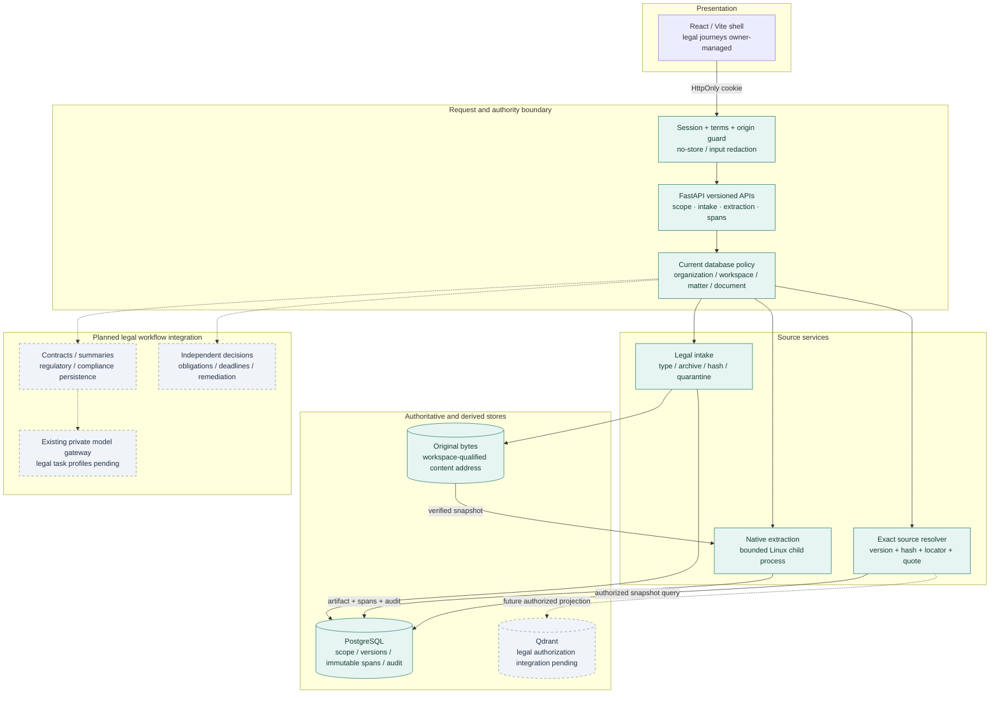
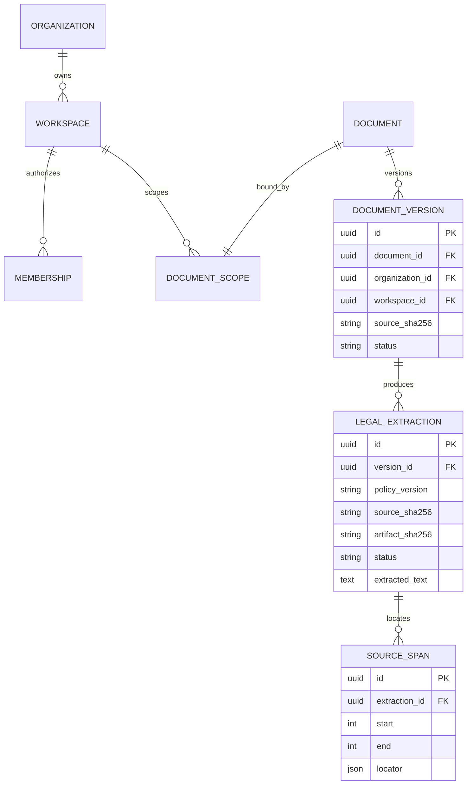
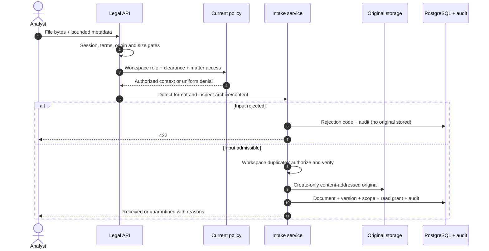
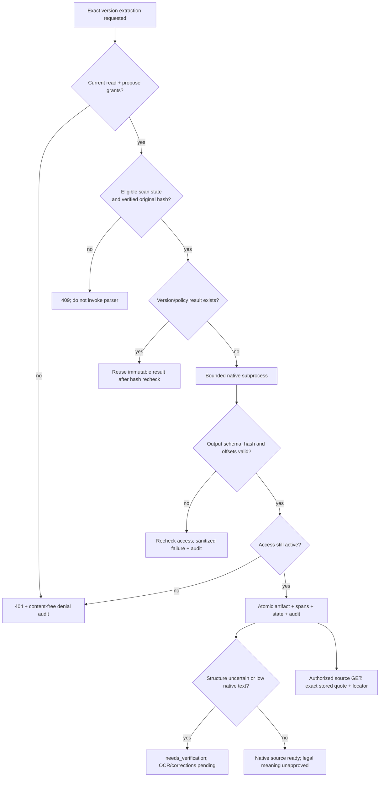
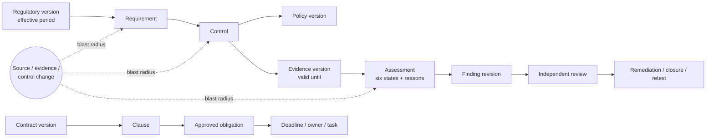

<div align="center">

# Legal & Regulatory Assurance Platform

### From legal text to traceable decisions.

**Contract intelligence · Regulatory change · Compliance assurance · Grounded summaries**

An evidence-first engineering platform that connects documents, interpretations, evidence,
accountable people and time through persistent provenance and human-governed workflows.

[](https://github.com/loktrishal-05/legal-compliance-regulatory-workbench/actions/workflows/legal-backend-checks.yml)


[Architecture](#architecture) · [System design](#system-design) · [Workflows](#workflows) · [Delivery status](#delivery-status) · [Verification](#verification) · [Quick start](#quick-start)

</div>

---

> [!IMPORTANT]
> **Documentation and code advance through separate reviewed checkpoints.** This README presents
> the latest source architecture, with implementation status identified below. `main` currently has
> the identity/initial legal-scope baseline; the later intake and native-provenance implementation is
> on development and [PR #13](https://github.com/loktrishal-05/legal-compliance-regulatory-workbench/pull/13).
> Publishing this README does not promote that backend code or establish operational-pilot acceptance.

## Product scope

The product connects three required pillars—contract analysis, compliance monitoring and document
summarization—into one evidence-bearing lifecycle. Regulatory intelligence supplies versioned inputs
to that lifecycle rather than an isolated feed dashboard.

| Pillar | Intended operational output | Current source-checkpoint status |
|---|---|---|
| **Contract intelligence** | Clauses, parties, duties, dates, playbook deviations and reviewed obligations | Native source foundation verified; legal analysis/playbooks remain |
| **Regulatory intelligence** | Governed sources, effective versions, diffs and human applicability decisions | Deterministic version/diff/freshness core tested; persistence remains |
| **Compliance assurance** | Requirement → control → evidence mappings, six explainable states and drift impact | Deterministic assessment and impact core tested; integrated domain workflow remains |
| **Grounded summaries** | Audience-specific summaries with exact evidence for material claims | Immutable source quote resolver verified in PR #13; summary generation remains |

**Authority rule:** AI may extract, compare and draft. Deterministic services own identity,
permissions, state, rules and timers. Authorized humans own material legal decisions.

---

## Architecture

A **modular monolith** keeps policy and transaction boundaries inspectable. PostgreSQL owns domain
records; originals are hash-preserved; search is a rebuildable projection; model calls are an assistive layer.
Existing session, native extraction, governance and audit infrastructure is reused.

The diagram describes the latest source checkpoint. **Solid paths are verified there; dashed paths
are planned legal integration.** See [Delivery status](#delivery-status) for branch availability.



### Engineering invariants

- **Deny by default:** membership alone does not expose confidential content; role, clearance and explicit grants apply to each operation.
- **Tenant-qualified relationships:** composite foreign keys prevent cross-workspace source bindings at the database boundary.
- **Immutable evidence:** extraction/spans reject UPDATE, DELETE and TRUNCATE; history is not rewritten to correct an interpretation.
- **Transactional audit:** authoritative changes and mandatory audit records share transaction ownership.
- **Evidence before meaning:** native extraction readiness does not approve a legal conclusion.

---

## System design

### Responsibility and failure boundaries

| Concern | Authority / storage boundary | Failure behavior |
|---|---|---|
| Identity | Server-owned cookie session, current terms and account state | Expired/revoked identities deny access |
| Legal access | Active tenant/workspace/matter/document policy, role and clearance | Unknown and inaccessible resources share a 404; denial audit excludes content |
| Original content | Source hash + workspace-qualified file address | Tampering/missing originals block parsing; no silent repair |
| Native parsing | One verified byte snapshot, resource-bounded Linux subprocess | Sanitized timeout/invalid-output failure; no inherited application secrets |
| Source provenance | Immutable PostgreSQL artifact/span records | Qualified version/hash FK and exact offset validation |
| Legal conclusions | Planned source-grounded analyses and independent human decisions | Provisional until the relevant evidence and review gates pass |
| Search / AI | Existing engines, planned legal adapters | No global retrieve-then-hide shortcut or unrestricted model authority |

### Source lineage model

Implemented in the latest native-provenance checkpoint, not yet promoted into `main`:



Extraction FKs bind the complete organization/workspace/document/version/source-hash tuple.
The diagram summarizes domain relationships, including scoped legal documents rather than unmapped legacy rows.

| Format | Source locator | Quality boundary |
|---|---|---|
| TXT | Line + Unicode codepoint offsets in the stored extraction | Decoded text and CRLF preserved; no inferred legal meaning |
| DOCX | XML part + paragraph ordinal, including table paragraphs | No fabricated page numbers; native structure needs verification |
| PDF | Page + top-left bounding box + extracted-text offsets | Headings retained; native layout/scanned or low-text pages need verification |

### Idempotency and consistency

Same bytes deduplicate within the authorized workspace. Extraction locks its source version,
reuses the version/policy artifact and rechecks the original hash on replay. Artifact, spans,
processing state and audit commit together. Failure history persists with sanitized codes;
current grants are rechecked after parser success and failure. Additive migration `0024` refuses
a downgrade that would discard extraction history.

---

## Workflows

### 1. Secure intake sequence



Real HTTP uploads currently quarantine because no malware scanner is configured. Suspicious
active content, embedded objects and external references also quarantine. Intake itself grants read access only.

### 2. Extraction and exact source flow



Development containment: 25 MiB input, up to 100 PDF pages, 2 MiB extracted characters,
2,000 spans, 5-second child CPU limit, 512 MiB address space, 8 MiB output-file limit,
and 10-second wall deadline. These bounds are not a deployment-grade kernel network/filesystem sandbox
or a durable asynchronous job engine; those remain E2 acceptance work.

### 3. Target compliance lifecycle

This is the **target operational design**. Deterministic version/assessment/impact functions exist;
persistent domain entities, review binding and timers are not an accepted integrated legal workflow yet.



**Assessment vocabulary:** `satisfied` · `partially_satisfied` · `unsatisfied` ·
`insufficient_evidence` · `not_applicable` · `needs_review`.
Missing evidence is not proof of a violation. Non-applicability requires an authorized decision.
Expiry and source changes invalidate current projections without rewriting historical assessments.

---

## Delivery status

| Reference | Code available there |
|---|---|
| `main` | Identity and initial legal-scope baseline; this documentation update |
| `feat/legal-regulatory-platform-migration` | Reviewed D foundation, E1 intake and deterministic regulatory/compliance core |
| [PR #13 / continuation branch](https://github.com/loktrishal-05/legal-compliance-regulatory-workbench/pull/13) | E1 hardening, E2a native extraction/spans/API and replay correction; review/integration pending |

| Phase | Current source-program status | Remaining acceptance |
|---|---|---|
| A / B | Source/configuration and development design complete | Deployment-specific approvals remain |
| C / D | Backend identity and D development exit recorded | Historical full-runtime regression gaps; frontend identity acceptance |
| E | E1 / E2a verified partial checkpoints | Scanner, OCR/corrections, durable dispatch, production isolation and legal retrieval |
| F | Planned | Contract analysis, playbooks, cited summaries and legal fixtures |
| G / H | Deterministic core tested | Registry/domain persistence, source/review integration |
| I / J | Planned legal integration | Reviews, obligations, timers, remediation and scoped legal audit |
| K | Owner-managed | Real legal journeys and frontend acceptance |
| L / M | Pending | Integrated evaluation/security, restore/recovery and final acceptance |

All 66 requirements remain tracked. Publishing a checkpoint does not establish full-FR or pilot acceptance.

## API surface

Base: `/v1/workspaces/{workspace_id}`. Current account/session/terms and database policy supply actor,
role, clearance and tenant context. Clients never supply trusted authority headers.

| Method | Route suffix | Source availability |
|---|---|---|
| GET | Base path | Initial scoped metadata baseline on `main` |
| GET | `/documents/{document_id}` | Initial scoped metadata baseline on `main` |
| POST | `/documents` | E1 development intake; no real scanner release |
| POST | `/documents/{document_id}/versions/{version_id}/extractions` | PR #13; explicit read + propose grants |
| GET | `/documents/{document_id}/versions/{version_id}/spans/{span_id}` | PR #13; authorized immutable quote/locator/hash |

Errors include uniform unavailable (404), quarantine/integrity block (409), and sanitized parser failures (422).
Final legal review/release authority is separate from native source access.

---

## Technology decisions

| Layer / decision | Choice | Rationale |
|---|---|---|
| Presentation | React 19 / Vite 7 | Retain the existing shell; legal frontend owner-managed |
| API | FastAPI / bounded Pydantic contracts | Central session/origin and current-policy enforcement |
| System of record | PostgreSQL 17 / SQLAlchemy 2 / Alembic | Transactions, qualified FKs and additive immutable history |
| Native documents | PyMuPDF + standard-library ZIP/XML/text | Reuse native inspection; no invented OCR/model content |
| Search | Qdrant dense/sparse hybrid + local reranking | Existing reusable engine; legal ACL cutover pending |
| Language tasks | Private/local gateway + LangGraph | Approved data/provider boundary; legal profiles pending |
| Topology | Modular monolith + relational links | No premature microservices or graph database |
| Audit | Canonical SHA-256-linked append-only events | Preserve old envelopes; no compliance-certification claim |

## Verification

Latest **continuation-source** evidence, 2026-10-07. These counts are not a claim about the older `main` code tree:

| Check | Result |
|---|---|
| Scope/session/API/security regression | **126 / 126 passed** |
| Focused native extraction / source provenance | **32 / 32 passed** |
| Processed-upload replay API confirmation | **6 / 6 passed** |
| New service / native worker line coverage | **90% / 84%**; no whole-app or branch coverage claim |
| Disposable migration/history proof | **Fresh + 0018 → 0024 passed** |
| Public README rendering | **Five Mermaid diagrams** verified in GitHub preview |

Evidence and remaining gaps are in the
[continuation validation report](https://github.com/loktrishal-05/legal-compliance-regulatory-workbench/blob/integration/backend-continuation-20261007/docs/VALIDATION_REPORT.md).
Baseline CI is an engineering check, not independent legal or operational acceptance.

---

## Quick start

Read [AGENTS.md](AGENTS.md) and the [isolated runtime guide](docs/LEGAL_RUNTIME_SETUP.md) first.
Use the continuation source linked in PR #13 to reproduce the latest native-provenance evidence;
running these commands on `main` exercises its earlier baseline instead.

The disposable Linux/PostgreSQL test project uses synthetic data, an internal network, no published
host ports/private mounts and no model calls. Its first build downloads pinned test dependencies.

```bash
docker compose -f infra/docker-compose.legal-core-test.yml config --quiet
docker compose -f infra/docker-compose.legal-core-test.yml build tests
docker compose -f infra/docker-compose.legal-core-test.yml run --rm tests
docker compose -f infra/docker-compose.legal-core-test.yml run --rm tests python -B -m scripts.validate_legal_migrations
docker compose -f infra/docker-compose.legal-core-test.yml down --volumes
```

Workspace provisioning is operator-only and audited. Preserve existing private `.env` files and
verify service ownership before startup. Isolated local ports: API `18000`, frontend `15173`,
PostgreSQL `55432`, Qdrant `16333/16334`.

`GET http://127.0.0.1:18000/health` after approved startup:

```json
{"status":"ok","service":"legal-compliance-regulatory-workbench-backend"}
```

Health is process liveness, not database/model readiness or legal acceptance.

## Development workflow

1. Branch from the protected development base; inspect phase dependencies and existing callers.
2. Use synthetic/public fixtures; preserve user work, old source/audit hashes and applied migrations.
3. Add relevant unit/API/PostgreSQL/failure checks and synchronize build/validation evidence.
4. Commit explicit intended paths, publish checkpoint results and open a scoped PR.
5. Require passing CI and the review specified in repository instructions; no self-approval or protection bypass.
6. Promote accepted work to `main` through a reviewed, history-preserving PR.

## People and ownership

| Contributor | Original project allocation |
|---|---|
| [Loktrishal K](https://github.com/loktrishal-05) | Product owner, architecture, frontend/landing and repository maintainer |
| [Harsha](https://github.com/Harsha-code-per) | Documents, contracts and grounded summaries |
| [Sanjjith](https://github.com/Sanjjith27) | Regulatory intelligence and compliance assurance |
| [Cholan](https://github.com/Cholan-kinnera) | Workflows, review, security and acceptance |

Allocations are historical context; current ownership is tracked in the repository issues.
Backend execution is AI-assisted under the owner's direction. The owner manages frontend/landing work;
an assistant using the owner's account is not an independent human reviewer.

## Engineering references

| Reference | Purpose |
|---|---|
| [Master specification](docs/Legal_Regulatory_Assurance_Platform_Master_Report.pdf) | Immutable product authority and all three acceptance pillars |
| [Build contracts](docs/LEGAL_DOMAIN_BUILD_CONTRACTS.md) | Tenant, source, authority, time and workflow invariants |
| [Requirement registry](docs/LEGAL_REQUIREMENT_TRACEABILITY.md) | 66 FRs and acceptance mapping |
| [Latest build guide](https://github.com/loktrishal-05/legal-compliance-regulatory-workbench/blob/integration/backend-continuation-20261007/docs/LEGAL_DOMAIN_MIGRATION_PLAN.md) | Current phase blockers and next work |
| [Latest handoff](https://github.com/loktrishal-05/legal-compliance-regulatory-workbench/blob/integration/backend-continuation-20261007/docs/SESSION_RESUME.md) | Verified continuation context |

### Acceptance boundaries

AI output is advisory. No signing, filing, universal compliance certification or autonomous high-impact
action is provided. No live regulatory connector is claimed. Enterprise identity/MFA, qualified legal
packs, retention/hold policies, real scanning, recovery and deployment approvals remain release gates.
Availability **99.5%** and search/metadata **approximately 2 seconds p95** are blueprint targets, not measured achievements.

<details>
<summary>Historical platform records</summary>

Industrial records remain provenance, not current legal acceptance or setup instructions:
[3A ingestion](docs/phase3a.md) · [3B1 OCR](docs/phase3b1.md) · [3B2 hybrid retrieval](docs/phase3b2.md) ·
[3C data](docs/phase3c.md) · [4A gateway](docs/phase4a.md) · [4R safety](docs/phase4-repair.md) ·
[5A governance](docs/phase5a.md) ([validation](docs/phase5a-validation.md)) ·
[5B approvals](docs/phase5b.md) ([validation](docs/phase5b-validation.md)).

</details>
